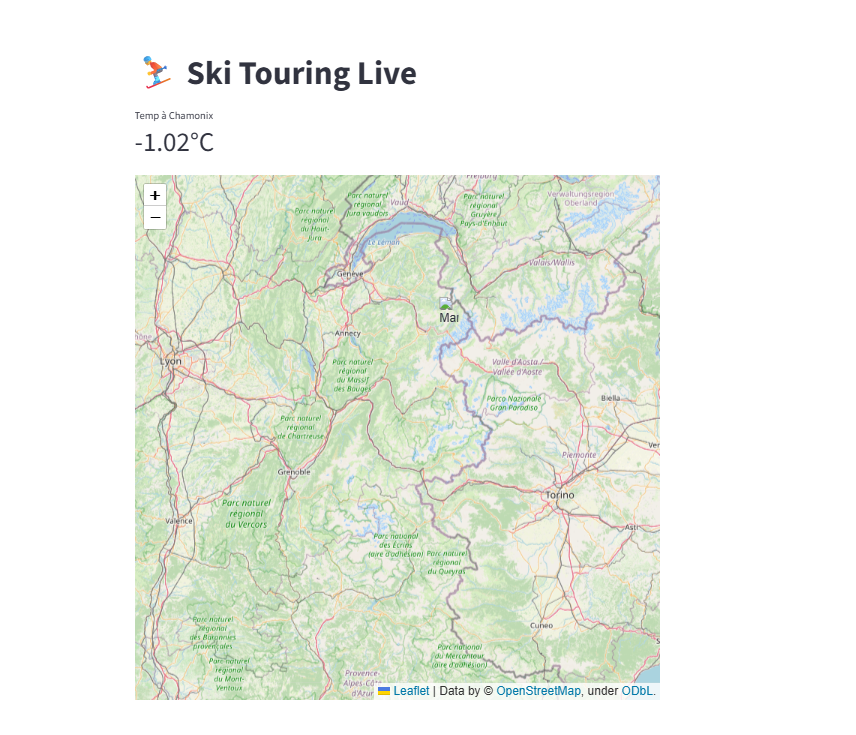

# ⛷️ Ski Touring Live

**Trouve les meilleures sorties ski de rando selon la météo, les conditions avalanche et ton niveau**


Ski Touring Live est ton assistant IA pour le ski de randonnée dans les Alpes. Il analyse en temps réel la météo, les bulletins d'avalanche et ta base d'itinéraires pour te recommander les 3 meilleures sorties adaptées à ton niveau.

**Fini les heures à croiser les infos** : en un coup d'œil, sache où aller ce week-end.

---

## 🎯 Fonctionnalités

- **🌡️ Météo temps réel** : Températures, précipitations, vent et enneigement via OpenWeather API
- **🗺️ 150+ itinéraires** : Chamonix, Vanoise, Écrins, Suisse, Italie avec métadonnées complètes
- **🤖 Scoring intelligent** : Algorithme qui croise conditions actuelles + caractéristiques itinéraires
- **📊 Dashboard interactif** : Carte des Alpes, filtres par niveau, visualisation des conditions
- **📈 ML Pipeline** : XGBoost pour prédire les meilleures sorties selon historique météo

---

## 🚀 Quick Start

### Prérequis

- Python 3.11+
- [Poetry](https://python-poetry.org/docs/#installation) pour la gestion des dépendances

### Installation

```bash
# Clone le repo
git clone https://github.com/Tinevagio/Ski-touring-live.git
cd Ski-touring-live

# Installe les dépendances
poetry install

# Configure ta clé API OpenWeather (gratuite)
cp .env.example .env
# Édite .env et ajoute : OPENWEATHER_API_KEY=ta_cle_ici
```

### Lancement

```bash
# Lance l'app Streamlit
poetry run streamlit run src/app.py

# L'app s'ouvre dans ton navigateur à http://localhost:8501
```

---

## 📁 Structure du projet

```
Ski-touring-live/
├── data/
│   ├── raw/                    # Données brutes
│   │   └── itineraires_alpes.csv  # 150 itinéraires avec D+, expo, GPS
│   ├── processed/              # Données nettoyées/transformées
│   └── weather_cache/          # Cache météo pour éviter trop d'appels API
├── notebooks/
│   ├── 01_scoring_rule_based.ipynb    # Feature engineering
│   ├── 02_xgboost_first_model.ipynb   # Premier modèle ML
│   └── 03_data_exploration.ipynb      # Analyse exploratoire
├── src/
│   ├── app.py                  # Application Streamlit principale
│   ├── data/
│   │   ├── loader.py          # Chargement itinéraires
│   │   └── weather.py         # API météo
│   ├── models/
│   │   ├── scorer.py          # Algorithme de scoring
│   │   └── ml_model.py        # Modèle XGBoost
│   └── utils/
│       ├── maps.py            # Génération cartes
│       └── filters.py         # Filtres utilisateur
├── scripts/
│   ├── update_weather.py      # Mise à jour données météo
│   └── train_model.py         # Entraînement modèle
├── assets/                     # Screenshots, images
├── tests/                      # Tests unitaires
├── pyproject.toml             # Config Poetry + dépendances
└── README.md
```

---

## 🗺️ Dataset

Le fichier `data/raw/itineraires_alpes.csv` contient 150 itinéraires avec :

| Colonne | Description | Exemple |
|---------|-------------|---------|
| `nom` | Nom de l'itinéraire | "Col du Passon" |
| `massif` | Massif montagneux | "Vanoise" |
| `denivele` | Dénivelé positif (m) | 1200 |
| `altitude_max` | Point culminant (m) | 2650 |
| `exposition` | Orientation principale | "N", "SE", "SW" |
| `difficulte` | Cotation ski | "F", "PD", "AD", "D" |
| `latitude` | Coordonnées GPS | 45.4567 |
| `longitude` | Coordonnées GPS | 6.7890 |
| `duree_estimee` | Temps montée (h) | 3.5 |

**Sources** : Camptocamp, Skitour.fr, topos personnels

---

## 🧠 Comment ça marche ?

### 1. Collecte des données

```python
# Charge les itinéraires
from src.data.loader import load_itineraires
routes = load_itineraires()

# Récupère la météo actuelle pour chaque zone
from src.data.weather import get_weather_for_massif
weather = get_weather_for_massif("Vanoise")
```

### 2. Scoring des itinéraires

L'algorithme évalue chaque itinéraire sur plusieurs critères :

- **Conditions météo** : Température, précipitations récentes, vent
- **Risque avalanche** : Croisement exposition itinéraire × bulletin BERA
- **Enneigement** : Hauteur de neige estimée selon altitude
- **Accessibilité** : Routes ouvertes, parkings disponibles
- **Niveau utilisateur** : Match difficulté technique × expérience

```python
from src.models.scorer import score_routes
recommendations = score_routes(routes, weather, user_level="intermediate")
```

### 3. Affichage des résultats

Top 3 recommandations avec :
- Score global (/100)
- Conditions détaillées
- Carte interactive
- Liens vers topos complets

---

## 🤖 Machine Learning

### Approche actuelle (v0.1)

**Rule-based scoring** : Règles expertes pondérées pour combiner facteurs météo et caractéristiques itinéraires.

### Roadmap ML (v0.2+)

1. **Dataset d'entraînement** : Collecte feedback utilisateurs après sorties (conditions réelles vs prédites)
2. **Features** : Météo J-7, historique enneigement, phases lunaires, fréquentation
3. **Modèle** : XGBoost → prédire score de "qualité sortie" (0-100)
4. **Production** : API FastAPI pour serving temps réel

Notebook de démo : `notebooks/02_xgboost_first_model.ipynb`

---

## 🔧 Configuration

### Variables d'environnement (.env)

```env
# API météo (obligatoire)
OPENWEATHER_API_KEY=ta_cle_openweather

# Cache météo (optionnel)
WEATHER_CACHE_HOURS=6

# Mode debug (optionnel)
DEBUG=False
```

### Personnalisation

Modifie `src/models/scorer.py` pour ajuster les pondérations :

```python
WEIGHTS = {
    "meteo": 0.35,      # Impact conditions actuelles
    "avalanche": 0.30,  # Sécurité
    "enneigement": 0.20, # Qualité neige
    "accessibilite": 0.15 # Praticité
}
```

---

## 🧪 Tests

```bash
# Lance tous les tests
poetry run pytest

# Tests avec couverture
poetry run pytest --cov=src tests/

# Tests d'un module spécifique
poetry run pytest tests/test_scorer.py
```

---

## 📸 Screenshots

### Dashboard principal



Conditions du jour : -8 °C à 2500 m, 30–50 cm de fraîche sur Chamonix/Vanoise → poudreuse garantie !

### Carte interactive


---

## 🛣️ Roadmap

### v0.2 (Q1 2025)
- [ ] Intégration bulletins avalanche Météo France API
- [ ] Mode hors-ligne avec données cached
- [ ] Export GPX des itinéraires recommandés

### v0.3 (Q2 2025)
- [ ] Feedback utilisateurs post-sortie
- [ ] Modèle ML en production
- [ ] Notifications push (conditions parfaites détectées)

### v1.0 (Q3 2025)
- [ ] Application mobile (Flutter)
- [ ] Communauté : partage photos/traces
- [ ] Prévisions J+3 avec confiance

---

## 🤝 Contribution

Les contributions sont les bienvenues ! Pour ajouter des itinéraires ou améliorer le scoring :

1. Fork le projet
2. Crée une branche (`git checkout -b feature/nouvelle-fonctionnalite`)
3. Commit tes changements (`git commit -m 'Ajout itinéraires Beaufortain'`)
4. Push vers la branche (`git push origin feature/nouvelle-fonctionnalite`)
5. Ouvre une Pull Request

**Guidelines** :
- Respecte la structure CSV pour nouveaux itinéraires
- Ajoute des tests pour les nouvelles fonctionnalités
- Documente ton code (docstrings)

---

## 📝 Licence

MIT License - voir [LICENSE](LICENSE) pour détails.

---

## 🙏 Remerciements

- **APIs** : OpenWeather, Météo France
- **Données** : Communautés Camptocamp, Skitour.fr
- **Inspiration** : Tous les randonneurs qui partagent leurs topos

---

## 📧 Contact

**Tinevagio** - [@Tinevagio](https://github.com/Tinevagio)

**Projet** : [https://github.com/Tinevagio/Ski-touring-live](https://github.com/Tinevagio/Ski-touring-live)

---

## ⚠️ Avertissement Sécurité

**Ski Touring Live est un outil d'aide à la décision, pas un substitut au jugement humain.**

- Consulte TOUJOURS le bulletin avalanche officiel avant de partir
- Vérifie les conditions sur place (neige, météo, groupe)
- Adapte ta sortie à ton niveau réel et celui du groupe
- En montagne, la prudence prime sur les recommandations algorithmiques

**La sécurité est ta responsabilité. Bonne glisse ! 🎿**